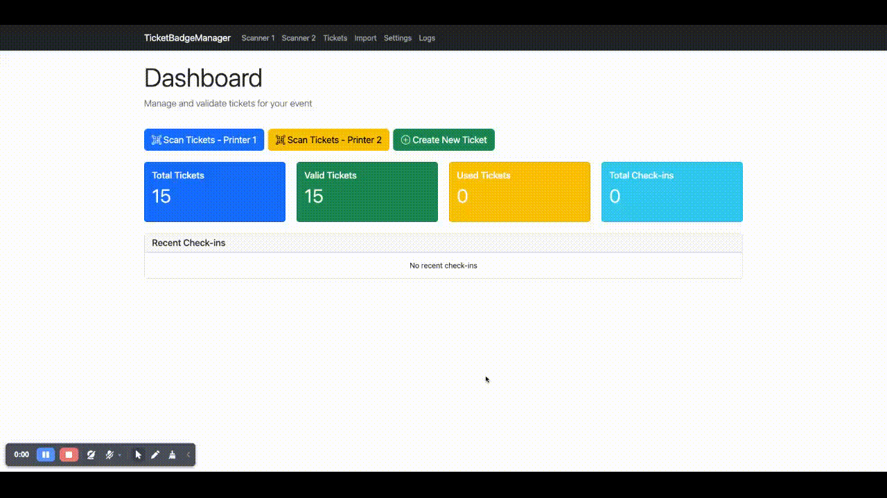
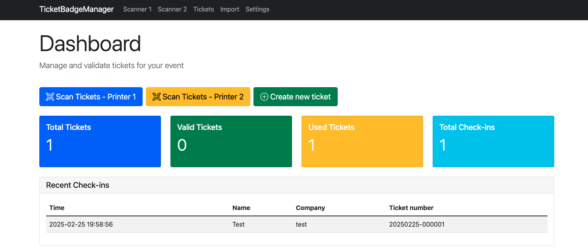

# TicketBadgeManager

[Česká verze](README_CZ.md) | English

## Table of Contents

- [TicketBadgeManager](#ticketbadgemanager)
- [Features](#features)
- [Requirements](#requirements)
- [Installation](#installation)
  - [Quick Setup (Windows)](#quick-setup-windows)
  - [Manual Setup](#manual-setup)
  - [Development Setup (macOS/Linux)](#development-setup-macoslinux)
- [Configuration](#configuration)
  - [Environment Variables](#environment-variables)
  - [Authentication](#authentication)
  - [Printer Settings](#printer-settings)
  - [Language Settings](#language-settings)
- [Usage](#usage)
  - [Starting the Server](#starting-the-server)
  - [Accessing the Application](#accessing-the-application)
  - [Main Features](#main-features)
- [API Integration](#api-integration)
- [Updating the Application](#updating-the-application)
- [Translation](#translation)
- [Project Structure](#project-structure)
- [Security Features](#security-features)
- [Troubleshooting](#troubleshooting)
- [Contributing](#contributing)
- [License](#license)

## Features

**TicketBadgeManager** is a Django application designed for event check-in and badge printing on TSC thermal printers.

### Key Features:
- ✅ **CSV Import** - Import tickets from CSV files with flexible field mapping
- ✅ **QR Code Scanning** - Check-in attendees using QR codes via web camera
- ✅ **Badge Printing** - Print badges with names and company information
- ✅ **Special Label Printing** - Print custom labels for Press, Host, VIP, Staff, etc.
- ✅ **Eventee Integration** - Automatically invite attendees to Eventee platform
- ✅ **Multi-printer Support** - Support for multiple TSC printers
- ✅ **Bilingual Support** - English and Czech language interface
- ✅ **Real-time Statistics** - Track check-ins and ticket status
- ✅ **Secure Access** - Optional authentication system
- ✅ **Activity Logging** - Comprehensive audit trail
- ✅ **Rate Limiting** - Protection against abuse

### Application Screenshots:



## Requirements

- **Python 3.11** (tested with 3.11.9)
- **Windows OS** (for printer functionality)
- **TSC TDP-225** thermal printer (or compatible)
- **Git** (or download as ZIP)

### Python Packages:
- Django 5.1.1
- Pillow (image processing)
- pandas (CSV handling)
- qrcode (QR code generation)
- python-dotenv (environment variables)
- django-ratelimit (rate limiting)
- django-crispy-forms (form styling)
- crispy-bootstrap5 (Bootstrap 5 integration)
- pywin32 (Windows printer support)
- See `requirements.txt` for full list

## Installation

### Quick Setup (Windows)

1. **Clone the repository:**
   ```bash
   git clone https://github.com/kalus-msic/TicketBadgeManager.git
   cd TicketBadgeManager
   ```

2. **Run the installation script:**
   ```bash
   install_app.bat
   ```
   
   This will create the database and a default user:
   - Username: `TBM`
   - Password: `TBM`

3. **Configure environment:**
   - Copy `.env.example` to `.env`
   - Update settings as needed (especially `SECRET_KEY`)
   - Authentication is disabled by default (`DISABLE_AUTH=True`)
   - To enable authentication, set `DISABLE_AUTH=False`

4. **Compile translations (required for language switching):**
   ```bash
   python manage.py compilemessages
   ```
   
   Note: This requires `gettext` to be installed on your system:
   - Windows: Install from https://mlocati.github.io/articles/gettext-iconv-windows.html
   - Linux: `sudo apt-get install gettext`
   - macOS: `brew install gettext`

5. **Start the server:**
   ```bash
   start_server.bat
   ```

### Manual Setup

1. **Create virtual environment:**
   ```bash
   python -m venv venv
   ```

2. **Activate virtual environment:**
   
   Windows (CMD):
   ```cmd
   venv\Scripts\activate
   ```
   
   Windows (PowerShell):
   ```powershell
   Set-ExecutionPolicy Unrestricted -Scope Process
   venv\Scripts\Activate.ps1
   ```

3. **Install dependencies:**
   ```bash
   pip install -r requirements.txt
   ```

4. **Set up environment variables:**
   ```bash
   copy .env.example .env
   ```
   Edit `.env` file with your settings.

5. **Create necessary directories:**
   ```bash
   mkdir logs
   mkdir temp
   mkdir locale
   ```

6. **Run migrations:**
   ```bash
   python manage.py migrate
   ```

7. **Compile translations:**
   ```bash
   python manage.py compilemessages
   ```

8. **Create superuser (optional):**
   ```bash
   python manage.py createsuperuser
   ```

9. **Start server:**
   ```bash
   python manage.py runsslserver 0.0.0.0:8000
   ```

### Development Setup (macOS/Linux)

For development on non-Windows systems:

```bash
# Use the setup script
chmod +x setup_dev.sh
./setup_dev.sh

# Or manually install without Windows-specific packages
pip install $(grep -v pywin32 requirements.txt)
```

## Configuration

### Environment Variables

Create a `.env` file in the project root:

```env
# Django settings
SECRET_KEY=your-secure-secret-key-here
DEBUG=False
ALLOWED_HOSTS=127.0.0.1,localhost,192.168.1.100

# Authentication
DISABLE_AUTH=True  # Set to False to enable login requirement

# Eventee API
EVENTEE_API_TOKEN=your-eventee-api-token

# Logging
LOG_LEVEL=INFO

# Security (for production)
SECURE_SSL_REDIRECT=False
SESSION_COOKIE_SECURE=False
CSRF_COOKIE_SECURE=False

# Rate limiting
RATELIMIT_ENABLE=True
```

**Important:** Always generate a new `SECRET_KEY` for production:
```bash
python -c "from django.core.management.utils import get_random_secret_key; print(get_random_secret_key())"
```

### Authentication

By default, authentication is **disabled** (`DISABLE_AUTH=True`). To enable:

1. Set `DISABLE_AUTH=False` in `.env`
2. Create admin user: `python manage.py createsuperuser`
3. Access admin at: https://localhost:8000/admin/

### Printer Settings

For TSC TDP-225 printers:

1. **Install printer drivers** from manufacturer
2. **Rename printers** in Windows:
   - Primary scanner: `TDP-2251`
   - Secondary scanner: `TDP-2252`

**Windows 10:**
- Control Panel → Devices and Printers
- Right-click TSC TDP-225 → Printer Properties → General
- Change name to `TDP-2251` or `TDP-2252`

**Windows 11:**
- Settings → Printers & scanners
- Select TSC TDP-225 → Printer properties → General
- Change name to `TDP-2251` or `TDP-2252`

### Language Settings

The application supports English and Czech languages:

- Default language: English
- Switch languages using the dropdown in the navigation bar
- Language preference is saved in session

## Usage

### Starting the Server

1. **With SSL (required for QR scanning):**
   ```bash
   python manage.py runsslserver 0.0.0.0:8000
   ```

2. **Without SSL (local development only):**
   ```bash
   python manage.py runserver 0.0.0.0:8000
   ```

**Note:** HTTPS is required for camera access when scanning QR codes.

### Accessing the Application

- **Local:** https://127.0.0.1:8000/
- **Network:** https://[YOUR-IP]:8000/
- **Example:** https://192.168.1.100:8000/

### Main Features

1. **Dashboard** (`/`)
   - View statistics
   - Recent check-ins
   - Quick actions

2. **Ticket Management** (`/tickets/`)
   - Search and filter tickets
   - View ticket details
   - Edit ticket information
   - Bulk operations (reset status, delete)

3. **Import Tickets** (`/import/`)
   - Upload CSV files
   - Replace all tickets or add new ones
   - Flexible field mapping

4. **QR Scanner** (`/scanner/`)
   - Scan QR codes using device camera
   - Automatic check-in
   - Optional badge printing
   - Two scanner instances for different printers

5. **Special Labels** (`/special-labels/`)
   - Print custom labels without QR codes
   - Perfect for Press, Host, VIP, Staff badges
   - Batch printing with configurable quantity
   - Quick templates for common label types

6. **Settings** (`/settings/`)
   - Configure Eventee API token
   - Set required ticket fields
   - Delete all data or check-ins
   - Test API connection

7. **Logs** (`/logs/`)
   - View all system activities
   - Filter by event type
   - Track errors and check-ins

## API Integration

### Eventee Integration

1. Go to Settings (`/settings/`)
2. Enter your Eventee API token
3. Test connection to verify token
4. Enable "Invite to Eventee" when creating/editing tickets

### CSV Import Format

Supported column names (case-insensitive):
- **QR Code:** `Ticket Number`, `Číslo vstupenky`, `Unique Ticket URL`
- **Name:** `Ticket First Name`, `Jméno`, `Jméno_x`
- **Surname:** `Ticket Last Name`, `Příjmení`, `Příjmení_x`
- **Company:** `Ticket Company Name`, `Firma`, `Field1`
- **Email:** `Ticket Email`, `Email`, `E-mail`
- **Event:** `Event`, `Akce`, `Akce_x`

## Updating the Application

### Using update script (Windows):
```bash
update_app.bat
```

### Manual update:
```bash
git pull origin main
pip install -r requirements.txt
python manage.py migrate
python manage.py compilemessages
```

## Translation

The application is fully bilingual (English/Czech):

### Setup translations:
1. **Install gettext** (required for compilemessages):
   - Windows: https://mlocati.github.io/articles/gettext-iconv-windows.html
   - Linux: `sudo apt-get install gettext`
   - macOS: `brew install gettext`

2. **Compile translations** (required after installation or updates):
   ```bash
   python manage.py compilemessages
   ```

3. **Switch language** using the dropdown in the navigation bar

### For developers - Extract new strings:
```bash
python manage.py makemessages -l en
python manage.py makemessages -l cs
```

### Troubleshooting language switching:
- If translations don't appear, run `compilemessages` and restart the server
- Clear browser cache and cookies
- Check that `.mo` files exist in `locale/cs/LC_MESSAGES/`

## Project Structure

```
TicketBadgeManager/
├── tickets/                 # Main application
│   ├── services/           # Business logic services
│   │   ├── ticket_service.py
│   │   ├── printing_service.py
│   │   └── eventee_service.py
│   ├── utils/              # Utilities
│   │   ├── validators.py
│   │   ├── text_utils.py
│   │   └── error_handlers.py
│   ├── views/              # View modules
│   │   ├── dashboard_views.py
│   │   ├── ticket_views.py
│   │   ├── import_views.py
│   │   ├── scanner_views.py
│   │   ├── special_label_views.py
│   │   └── settings_views.py
│   ├── templates/          # HTML templates
│   ├── static/             # CSS, JS, images
│   ├── locale/             # Translation files
│   └── migrations/         # Database migrations
├── ticket_badge_manager/    # Django settings
├── locale/                 # Project-wide translations
│   ├── en/                # English
│   └── cs/                # Czech
├── logs/                   # Application logs
├── temp/                   # Temporary files
├── .env                    # Environment variables
├── .env.example           # Example environment file
└── requirements.txt        # Python dependencies
```

## Security Features

- **Environment-based configuration** - Sensitive data in `.env` file
- **CSRF protection** - Enabled by default
- **Rate limiting** - Prevents brute force attacks (60/min for scanning, 10/hr for imports)
- **Input validation** - All user inputs are sanitized
- **Secure headers** - Security headers in production
- **Activity logging** - Comprehensive audit trail
- **Optional authentication** - Can require login for all features
- **SQL injection protection** - Using Django ORM
- **XSS protection** - Template auto-escaping

## Troubleshooting

### Common Issues:

1. **"Module not found" errors:**
   - Ensure virtual environment is activated
   - Run `pip install -r requirements.txt`

2. **Camera not working for QR scanning:**
   - Use HTTPS (required for camera access)
   - Check browser permissions
   - Allow camera access for the site

3. **Printer not working:**
   - Verify printer name matches configuration (TDP-2251 or TDP-2252)
   - Check Windows printer settings
   - Ensure TSCLIB.dll is in `tickets/libs/`
   - Verify printer is online and has paper

4. **Translation not working:**
   - Run `python manage.py compilemessages`
   - Check that locale directories exist
   - Restart the server after compiling

5. **"Secret key" warning:**
   - Generate new key: `python -c "from django.core.management.utils import get_random_secret_key; print(get_random_secret_key())"`
   - Add to `.env` file

### Firewall Configuration

For network access, open port 8000:

**Windows (Admin CMD):**
```bash
netsh advfirewall firewall add rule name="Django TicketBadgeManager" protocol=TCP dir=in localport=8000 action=allow profile=private,domain
```

### Logs

Check `logs/tickets.log` for detailed error information.

## Contributing

1. Fork the repository
2. Create feature branch (`git checkout -b feature/AmazingFeature`)
3. Commit changes (`git commit -m 'Add some AmazingFeature'`)
4. Push to branch (`git push origin feature/AmazingFeature`)
5. Open Pull Request

## License

This project is licensed under the MIT License - see the [LICENSE](LICENSE) file for details.

---

**Note:** This application is designed for local network use. For internet deployment, additional security measures should be implemented.